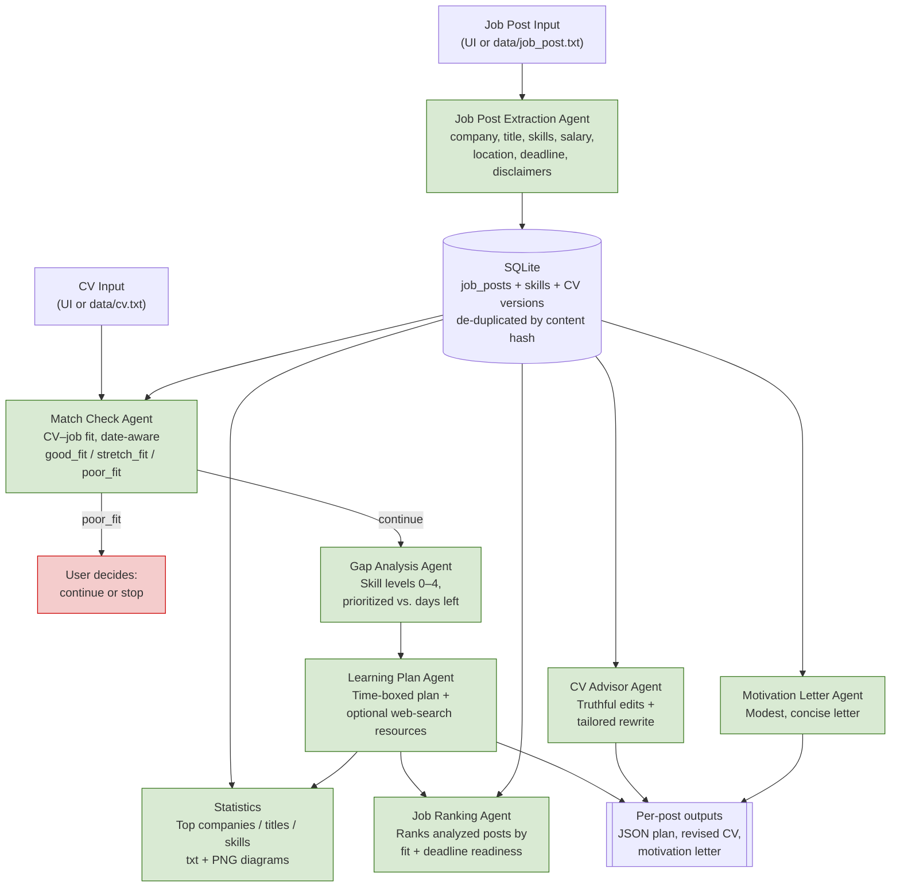
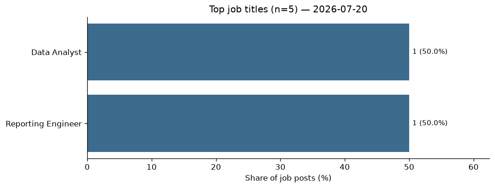
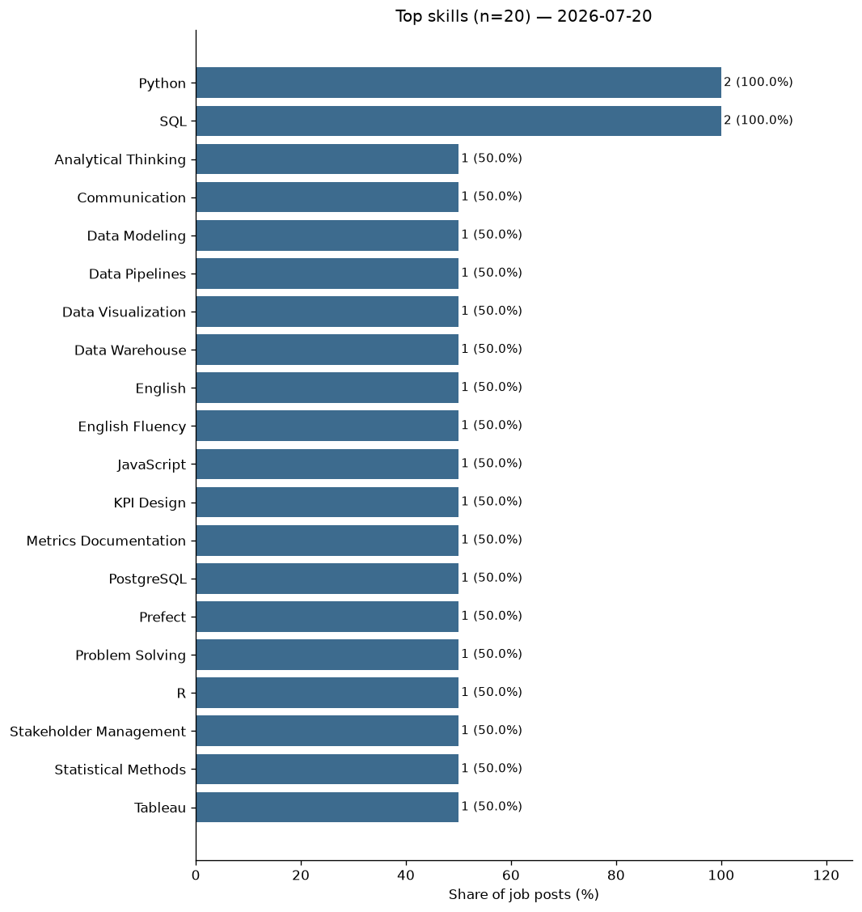

# Job Preparation Multiagent AI

AI orchestration tool to help you prepare for a **specific job application**: paste a job posting and your CV, and the system evaluates fit, analyzes skill gaps against the deadline, builds a prioritized learning plan (with optional real web resources), tailors your CV, drafts a motivation letter, ranks which jobs to pursue, and refreshes job-market statistics — all grounded in that specific role, not generic advice.

Built as a portfolio project demonstrating multi-agent orchestration, structured outputs, optional tool use (web search), local persistence, and a resilient pipeline shared by a Streamlit UI and a CLI.

## Why this project

Generic "what should I learn for role X" advice ignores that every job posting has different requirements, priorities, and a real deadline. This system treats each job post as its own case: it evaluates what you already know (from your CV), what the posting asks for, how much time you have before the deadline, and builds a plan around that.

## How it works



## Agents

Each agent is a distinct system prompt (and, where relevant, a distinct toolset) — not a separate service. Agents are pure LLM calls that return structured JSON (parsed defensively via `utils/llm_json.py`). Orchestration lives in the `services/` layer, reused by both the CLI (`main.py`) and the UI (`app.py`).

| Agent | Responsibility |
|---|---|
| **Job Post Extraction Agent** | Extracts structured fields (company, title, salary, location type, deadline, disclaimers, summary, skills) when a posting is saved. |
| **Match Check Agent** | Evaluates whether the CV is a realistic fit (`good_fit` / `stretch_fit` / `poor_fit`) before deeper analysis. Date-aware for in-progress vs. completed experience. |
| **Gap Analysis Agent** | Grades skill levels on a 0–4 scale, prioritizes gaps by importance and time-to-learn, and weighs them against days remaining until the deadline. |
| **Learning Plan Agent** | Turns prioritized gaps into a realistic, time-boxed study plan. Always attempted when the user proceeds past fit. Optional OpenRouter web search for resources, with fallback to model knowledge when search is unavailable. |
| **CV Advisor Agent** | Recommends concrete, truthful CV edits and produces a revised CV. Always attempted when the user proceeds past fit. Never fabricates — only reuses facts already in the CV. Date-aware. |
| **Motivation Letter Agent** | Drafts a concise (under one A4 page), modest letter explaining why the candidate is applying to this company and role. Always attempted when the user proceeds past fit. |
| **Job Ranking Agent** | After each analysis, ranks all analyzed job posts by fit and whether gaps can be closed before each deadline, and recommends which job (and learning path) to pursue first. |

## Data model

Each pasted job posting is stored as its own record in a local **SQLite** database (`data/jobs.db`):

- **`job_posts`**: company, job_title, salary, location_type, job_post_deadline, disclaimers, summary, date_saved, match_verdict, match_reasoning, `status`, `content_hash` (duplicate detection), `txt_path` (archived raw text), `cv_version_id` (which CV the analysis used), and `analysis_summary` (compact JSON for ranking). A post can be saved before analysis (`status = "saved"`); the pipeline updates it to `"continued"` or `"declined"`.
- **`job_post_skills`**: one row per extracted skill, linked to a job post.
- **`cv_versions`**: every distinct CV snapshot (content, hash, timestamp). Analyses are stamped with a `cv_version_id`.
- **`rankings`**: each cross-post ranking result (JSON, timestamp). Latest result is shown in CLI and UI.

The current CV is also kept as `data/cv.txt`. Raw posting text is archived to `data/job_posts/job_post_<company>_<title>_<date>_<hash>.txt`.

## Outputs

Per-job-post artifacts (git-ignored), offered as downloads in the UI:

- **Saved job post (raw text)** → `data/job_posts/job_post_<company>_<title>_<date>_<hash>.txt`
- **Learning plan** → `data/learning_plans/learning_plan_<company>_<title>_<date>_id<postid>.json`
- **Tailored CV** → `data/cv_revisions/cv_<company>_<title>_<date>_id<postid>.md`
- **Motivation letter** → `data/motivation_letters/motivation_letter_<company>_<title>_<date>_id<postid>.md`

## Job post statistics

After every analysis (and on demand in the UI), aggregate statistics are refreshed across **all saved job posts**:

| Metric | Default top-N | UI / CLI | Text report | PNG diagram | Linked in README |
|---|---|---|---|---|---|
| Companies | 5 | ✅ | — (kept private) | local only (git-ignored) | No |
| Job titles | 5 | ✅ | `statistics/job_titles.txt` | `statistics/diagrams/job_titles.png` | Yes |
| Skills | 20 | ✅ | `statistics/skills.txt` | `statistics/diagrams/skills.png` | Yes |

Share is the percentage of saved job posts that match that company/title, or that list that skill. You choose the exact top-N for each metric in both the CLI and the UI.

### Latest diagrams (job titles & skills)

These images update whenever statistics are refreshed. Company charts are intentionally **not** published here.

**Top job titles**



**Top skills**



Text reports: [`statistics/job_titles.txt`](statistics/job_titles.txt) · [`statistics/skills.txt`](statistics/skills.txt)

## Pipeline resilience

When you proceed past fit (including poor fit with the proceed toggle on), the pipeline **always aims** to produce a learning plan, revised CV, and motivation letter.

Each LLM stage tries **primary model → one retry → optional `FALLBACK_MODEL`** (from `.env`). Failures are logged to `logs/analysis.log` and recorded in the run result instead of crashing the whole pipeline. Independent stages still continue (e.g. CV and letter still run if the learning plan fails). If gap analysis fails after those attempts, a **fallback** built from the fit-check gaps is used so a learning plan can still be attempted.

If any of the three target outputs is missing, the UI and CLI show a notification and offer **Retry from failed stage**, which resumes from that point without redoing earlier successful work.

## Privacy

Self-hosted, single-user tool — not a multi-tenant SaaS. CV, job posts, generated outputs, and the SQLite DB are stored locally and git-ignored. Only the minimum text needed for a given agent call is sent to the model provider. When web search is enabled, relevant query/context is also sent to OpenRouter's search provider. Public statistics under `statistics/` cover **job titles and skills only**; company charts stay local and are not linked from the README.

## Tech stack

- **Language**: Python
- **LLM access**: [OpenRouter](https://openrouter.ai/) via the official `openai` Python SDK
- **Model**: configurable via `.env` (`MODEL=`). Optional `FALLBACK_MODEL=` is used automatically after a primary-model failure and retry.
- **Web search**: optional OpenRouter web plugin (Learning Plan Agent only); off by default (`ENABLE_WEB_SEARCH`)
- **Config**: `python-dotenv`
- **Storage**: SQLite (`data/jobs.db`); text/markdown/JSON under `data/`; public statistics under `statistics/`
- **Charts**: `matplotlib` bar charts in `statistics/diagrams/`
- **Entry point**: `run.py` — `python run.py [ui|cli]`
- **Frontend**: Streamlit (`app.py`); CLI (`main.py`)
- **Architecture**: thin front-ends; `config.py` for LLM setup; `services/` for shared orchestration; `agents/` for LLM calls; `data/` for persistence; `utils/` for helpers

> Note on free models: prompts/completions may be logged by the underlying inference provider. Fine for personal/portfolio use; revisit before using with more sensitive data. Free models are also less reliable at strict JSON, which is why parsing is defensive.

## Setup

1. Clone the repo:
   ```bash
   git clone <repo-url>
   cd job-preparation-multiagent-ai
   ```

2. Copy `.env.example` to `.env`:

   **PowerShell:**
   ```powershell
   Copy-Item .env.example .env
   ```

   **Bash/Linux/Mac:**
   ```bash
   cp .env.example .env
   ```

3. Set your OpenRouter credentials in `.env`:
   ```
   API_KEY=your-openrouter-api-key
   MODEL=deepseek/deepseek-chat-v3:free
   FALLBACK_MODEL=meta-llama/llama-3.3-70b-instruct:free
   ENABLE_WEB_SEARCH=false
   ```
   `FALLBACK_MODEL` is optional. When set, each LLM stage tries the primary model, retries once, then switches to the fallback model before giving up (useful when a free model returns empty responses or hits rate limits).

4. Install dependencies:
   ```bash
   pip install -r requirements.txt
   ```

5. For the CLI only, put your CV in `data/cv.txt` and optionally a new posting in `data/job_post.txt`. Edit these files directly (large pastes into some IDE consoles can drop lines). The web UI accepts these inputs in the browser.

6. Run:
   ```bash
   python run.py          # prompts you to choose Web UI or CLI
   python run.py ui       # Streamlit web UI
   python run.py cli      # CLI
   ```

> ⚠️ `.env`, `data/cv.txt`, `data/job_post.txt`, `data/job_posts/`, `data/jobs.db`, and generated output folders are git-ignored.

## Usage

Both UI and CLI share the same backend (`config`, `services`, `agents`, `data`).

### Web UI (Streamlit)

```bash
python run.py ui
```

- Paste and save/update your CV (each distinct save is versioned).
- Add multiple job posts (extracted, de-duplicated, saved to SQLite, archived under `data/job_posts/`).
- Select a saved post and run the full pipeline (fit → gap → learning plan → CV → letter → ranking → statistics), with toggles for **web search** (default off) and **proceed even if poor fit** (default on). When proceeding, the run always aims to create the learning plan, revised CV, and motivation letter.
- If a stage fails, see the on-page notification / failure list and use **Retry from failed stage** (details also in `logs/analysis.log`).
- View results inline and download the learning plan, tailored CV, and motivation letter. Each analysis shows which CV version it used.
- **"Which job to pursue"** ranks analyzed posts by fit and deadline readiness.
- **Job post statistics**: choose top-N for companies / titles / skills; tables and bar charts on the page; title/skill txt + PNG rewritten under `statistics/`.

The terminal logs pipeline progress and an "Analysis complete" line when a UI run finishes.

### CLI

```bash
python run.py cli
```

Reads the CV from `data/cv.txt`, then lets you choose a **saved job post** or **add & analyze** a new one from `data/job_post.txt` (if that file has content). Then asks for web search and top-N statistics limits, and runs:

1. Fit verdict (`good_fit` / `stretch_fit` / `poor_fit`)
2. Gap analysis against the deadline
3. Learning plan (JSON) — always attempted when proceeding
4. Tailored CV (markdown) — always attempted when proceeding
5. Motivation letter (markdown) — always attempted when proceeding
6. Job ranking across analyzed posts
7. Statistics refresh (txt + PNG diagrams)

If a required stage fails, the CLI prints a notification (and writes `logs/analysis.log`) and asks whether to **retry from that stage**.

`data/job_post.txt` is optional — only used to add a new post. If there are no saved posts and that file is empty, the CLI tells you to add one.

## Project structure

```
.
├── run.py                           # single entry point — choose UI or CLI
├── config.py                        # shared LLM client/config
├── main.py                          # CLI front-end
├── app.py                           # Streamlit web UI
├── agents/
│   ├── match_check.py               # Match Check Agent
│   ├── job_post_extraction.py       # Job Post Extraction Agent
│   ├── gap_analysis.py              # Gap Analysis Agent
│   ├── learning_plan.py             # Learning Plan Agent (optional web search)
│   ├── cv_advisor_agent.py          # CV Advisor Agent
│   ├── motivation_letter_agent.py   # Motivation Letter Agent
│   └── job_ranking.py               # Job Ranking Agent
├── services/
│   ├── job_post_service.py          # extract → dedup → DB + archive
│   ├── analysis_service.py          # full pipeline orchestration
│   ├── ranking_service.py           # cross-post ranking
│   ├── statistics_service.py        # top companies/titles/skills → txt + PNG
│   └── cv_service.py                # CV save + versioning
├── statistics/                      # public aggregates (titles + skills)
│   ├── job_titles.txt
│   ├── skills.txt
│   └── diagrams/
│       ├── job_titles.png
│       ├── skills.png
│       └── companies.png            # local only (git-ignored)
├── data/
│   ├── cv.py
│   ├── job_post.py
│   ├── db.py                        # SQLite schema + queries
│   ├── learning_plan.py
│   ├── motivation_letter.py
│   ├── cv.txt                       # (gitignored)
│   ├── job_post.txt                 # (gitignored)
│   ├── jobs.db                      # (gitignored)
│   ├── job_posts/                   # (gitignored)
│   ├── learning_plans/              # (gitignored)
│   ├── cv_revisions/                # (gitignored)
│   └── motivation_letters/          # (gitignored)
├── utils/
│   ├── date_utils.py
│   ├── text_utils.py
│   ├── pipeline.py                  # run_stage() with failure recording
│   ├── analysis_log.py              # logs/analysis.log helpers
│   └── llm_json.py
├── logs/                            # (gitignored) analysis pipeline log
├── requirements.txt
├── .env.example
├── .gitignore
└── README.md
```

## License

This project is licensed under the MIT License.
