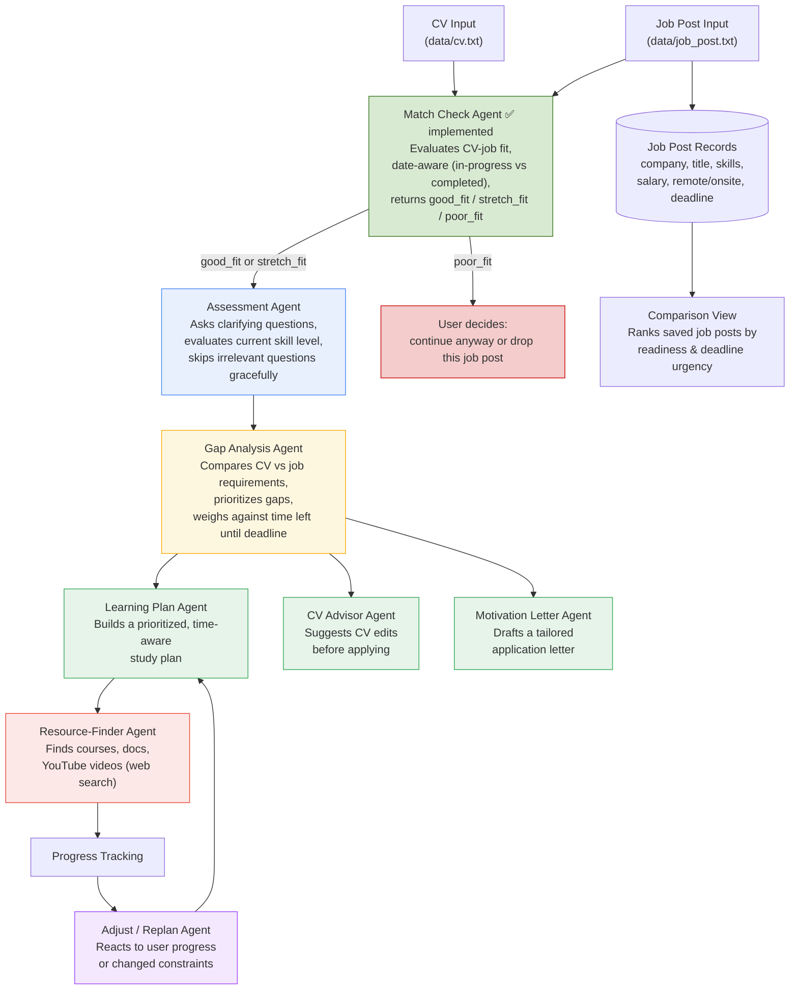

# Job Preparation Multiagent AI

A multi-agent AI system that helps you prepare for a **specific job application**: paste a job posting and your CV, and the system analyzes the skill gap, builds a prioritized learning plan, finds real learning resources, and can generate CV feedback and a motivation letter — all grounded in that specific role, not generic advice.

Built as a portfolio project demonstrating agentic AI system design: multi-agent orchestration, tool use, structured outputs, and adaptive planning.

## Why this project

Generic "what should I learn for role X" advice ignores the fact that every job posting has different requirements, priorities, and a real deadline. This system treats each job post as its own case: it evaluates what you already know (from your CV), what the specific posting actually asks for, how much time you realistically have before the deadline, and builds a plan around that — then adjusts as you make progress or as circumstances change.

## How it works



## Agents

| Agent | Status | Responsibility |
|---|---|---|
| **Match Check Agent** | ✅ Implemented | First step: evaluates whether the CV is a realistic fit for the job post at all (`good_fit` / `stretch_fit` / `poor_fit`) before investing in deeper analysis. Date-aware, so in-progress or recently completed education/experience is judged correctly against today's date. |
| **Assessment Agent** | Planned | Asks only relevant clarifying questions (time available, learning style, deadline); if a question is skipped, makes a reasonable default decision instead of blocking the pipeline. May also probe CV claims against the job post to gauge real skill depth (e.g. "you list SQL — have you used window functions?"). |
| **Gap Analysis Agent** | Planned | Compares CV against job requirements, grades skill level (not just yes/no), prioritizes gaps by importance and time-to-learn, and weighs this against days remaining until the application deadline. |
| **Learning Plan Agent** | Planned | Turns prioritized gaps into a structured, sequenced study plan with milestones. |
| **Resource-Finder Agent** | Planned | Uses web search to find current, real learning resources (courses, docs, YouTube) per topic — not hallucinated links. |
| **CV Advisor Agent** | Planned | Recommends concrete CV edits where skill evidence is unclear or missing, tailored to the specific job post. |
| **Motivation Letter Agent** | Planned | Drafts a tailored motivation letter using the CV, job post, and gap analysis as context. |
| **Adjust / Replan Agent** | Planned | Reacts to two kinds of change: the user reports progress/struggle on a topic, or the user's constraints change (less time, new priority) — replans accordingly. |

Each "agent" is a distinct system prompt (and, where relevant, a distinct toolset) — not a separate service. Agents pass a shared state object between stages rather than maintaining independent conversation histories.

## Data model (planned)

Each pasted job posting is stored as its own record, since gap analysis and plans are specific to that posting, not the user in general:

- **Job Post**: company, title, description, extracted skills/tools, salary, remote/onsite, application deadline, disclaimers, date saved
- **CV**: versioned, editable, stored as LLM-friendly text (file format support planned for later)
- **Gap Analysis**: linked to a CV + job post pair, includes per-skill evidence level and priority
- **Learning Plan**: linked to a gap analysis, includes milestones and resource links
- **Progress**: tracks completed topics, feeds the Adjust/Replan Agent

This also enables a **comparison view** across saved job posts — since users usually apply to more than one role, ranking posts by estimated readiness vs. deadline urgency helps decide where to focus effort first.

## Privacy

This is designed as a self-hosted, single-user tool, not a multi-tenant SaaS. Data (CV, job posts, gap analyses) is stored locally by default and is not shared beyond the LLM API call itself. Only the minimum text needed for a given agent call is sent to the model provider — nothing is persisted server-side outside your own machine.

## Tech Stack

- **Language**: Python
- **LLM access**: [OpenRouter](https://openrouter.ai/) — OpenAI-compatible API, used via the official `openai` Python SDK pointed at OpenRouter's base URL
- **Model**: configurable via `.env` (`MODEL=`); currently using `nvidia/nemotron-3-ultra-550b-a55b:free` — a free-tier model on OpenRouter, chosen for its large context window (1M tokens) and design for multi-step/agentic workflows, which fits this project's multi-agent direction
- **Config**: `python-dotenv` for environment variables (API key, model name)
- **Storage**: local text files for now (`data/cv.txt`, `data/job_post.txt`); SQLite planned once multiple job post records and progress tracking are needed
- **Frontend**: none yet (CLI only); Streamlit/Gradio or FastAPI planned

> Note on the model: since it's a free-tier model, prompts/completions may be logged by the underlying inference provider to improve the model (varies by provider — see OpenRouter's per-model "Providers" tab). Fine for this personal/portfolio use; worth revisiting before using with more sensitive data.

## Setup

1. Clone the repo:
   ```bash
   git clone <repo-url>
   cd job-preparation-multiagent-ai
   ```

2. Copy `.env.example` to `.env` and fill in the required values:

   **PowerShell:**
   ```powershell
   Copy-Item .env.example .env
   ```

   **Bash/Linux/Mac:**
   ```bash
   cp .env.example .env
   ```

3. Open `.env` and add your OpenRouter credentials:
   ```
   API_KEY=
   MODEL=
   ```

4. Install dependencies:
   ```bash
   pip install -r requirements.txt
   ```

5. Add your CV text to `data/cv.txt`, and the job posting text to `data/job_post.txt`. Edit these files directly (not via terminal paste — large pastes into some IDE consoles, e.g. PyCharm's Run panel, can silently drop lines).

6. Run the project:
   ```bash
   python main.py
   ```

> ⚠️ **Note:** The `.env` file contains sensitive credentials and should never be committed to Git. It's already included in `.gitignore`. `data/cv.txt` and `data/job_post.txt` contain personal data and are also excluded from version control.

## Usage

Currently a CLI tool. On run, it reads your CV and the target job post from `data/`, then prints a fit verdict:

```
Verdict: stretch_fit
Reasoning: ...
Matches: [...]
Gaps: [...]
```

*(will expand as more agents are added: gap analysis, learning plan, resources, CV/letter suggestions)*

- [x] CV input via file (`data/cv.txt`)
- [x] Job post input via file (`data/job_post.txt`)
- [x] Match Check Agent — evaluates CV-job fit before deeper analysis, date-aware
- [ ] Job post structured extraction (company, title, skills, salary, deadline, etc.)
- [ ] Handle `poor_fit` verdict: let user choose to continue anyway or stop
- [ ] Assessment Agent with adaptive, skippable clarifying questions
- [ ] Gap Analysis Agent with prioritization and deadline-awareness
- [ ] Learning Plan Agent
- [ ] Resource-Finder Agent with real web search tool use
- [ ] Progress tracking and Adjust/Replan Agent
- [ ] CV Advisor Agent
- [ ] Motivation Letter Agent
- [ ] Job post comparison / prioritization view
- [ ] Persistent storage (SQLite)
- [ ] Evaluation harness for agent output quality
- [ ] Simple front end (Streamlit/Gradio or FastAPI + minimal UI)

## Project Structure

```
.
├── main.py
├── utils/
│   ├── __init__.py
│   └── date_utils.py          # get_today() — injects current date into agent prompts
├── data/
│   ├── cv.py                  # load_cv / save_cv
│   ├── job_post.py             # load_job_post / save_job_post
│   ├── cv.txt                  # (gitignored)
│   └── job_post.txt            # (gitignored)
├── agents/
│   ├── __init__.py
│   └── match_check.py          # ✅ Match Check Agent
├── requirements.txt
├── .env.example
├── .gitignore
└── README.md
```

## License

This project is licensed under the MIT License.
