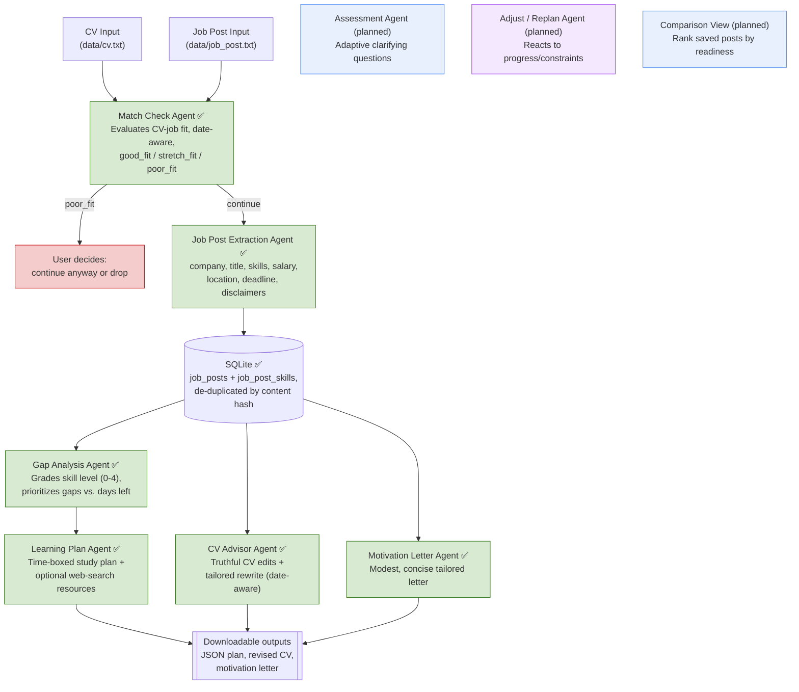

# Job Preparation Multiagent AI

A multi-agent AI system that helps you prepare for a **specific job application**: paste a job posting and your CV, and the system evaluates fit, analyzes the skill gap against the deadline, builds a prioritized learning plan (with optional real web resources), tailors your CV, and drafts a motivation letter — all grounded in that specific role, not generic advice.

Built as a portfolio project demonstrating agentic AI system design: multi-agent orchestration, structured outputs, tool use (web search), local persistence, and a resilient pipeline.

## Why this project

Generic "what should I learn for role X" advice ignores the fact that every job posting has different requirements, priorities, and a real deadline. This system treats each job post as its own case: it evaluates what you already know (from your CV), what the specific posting actually asks for, how much time you realistically have before the deadline, and builds a plan around that.

## How it works



## Agents

Each "agent" is a distinct system prompt (and, where relevant, a distinct toolset) — not a separate service. Agents are pure LLM calls that return structured JSON (parsed defensively via `utils/llm_json.py`); orchestration lives in `main.py` (CLI) and the `services/` layer, which the UI also reuses.

| Agent | Status | Responsibility |
|---|---|---|
| **Match Check Agent** | ✅ Implemented | First step: evaluates whether the CV is a realistic fit (`good_fit` / `stretch_fit` / `poor_fit`) before deeper analysis. Date-aware, so in-progress vs. completed education/experience is judged against today's date. |
| **Job Post Extraction Agent** | ✅ Implemented | Extracts structured fields (company, title, salary, location type, deadline, disclaimers, summary, skills) from the raw posting for storage. |
| **Gap Analysis Agent** | ✅ Implemented | Compares CV against job requirements, grades skill level on a 0–4 scale (not just yes/no), prioritizes gaps by importance and time-to-learn, and weighs them against days remaining until the deadline. |
| **Learning Plan Agent** | ✅ Implemented | Turns prioritized gaps into a realistic, time-boxed study plan that fits the remaining days. Finds real learning resources via **optional** OpenRouter web search, with a graceful fallback to the model's own knowledge when search is unavailable. |
| **CV Advisor Agent** | ✅ Implemented | Recommends concrete, truthful CV edits tailored to the posting and produces a revised CV. Never fabricates — only reuses facts already in the CV. Date-aware. |
| **Motivation Letter Agent** | ✅ Implemented | Drafts a concise (under one A4 page), modest, non-exaggerated letter explaining why the candidate is applying to this company and role. No fabrication. |
| **Assessment Agent** | Planned | Adaptive, skippable clarifying questions (time available, learning style), with sensible defaults instead of blocking. |
| **Adjust / Replan Agent** | Planned | Reacts to reported progress/struggle or changed constraints and replans. |
| **Comparison View** | Planned | Ranks saved job posts by estimated readiness vs. deadline urgency. |

## Data model

Each pasted job posting is stored as its own record in a local **SQLite** database (`data/jobs.db`), since gap analyses and plans are specific to a posting:

- **`job_posts`**: company, job_title, salary, location_type, job_post_deadline, disclaimers, summary, date_saved, match_verdict, match_reasoning, `status`, a `content_hash` used to avoid saving the same posting twice, and `txt_path` pointing to the archived raw text. A post can be saved before any analysis is run (`status = "saved"`); running the pipeline updates it to `"continued"` or `"declined"`.
- **`job_post_skills`**: one row per extracted skill, linked to a job post via foreign key.

The CV is not stored in the DB — it's read from `data/cv.txt` at runtime. The raw text of each saved posting is archived to `data/job_posts/job_post_<company>_<title>_<date>_<hash>.txt` so multiple postings are easy to tell apart on disk.

## Outputs

Generated artifacts are written per job post as downloadable files (git-ignored), ready for the front-end to render or export:

- **Saved job post (raw text)** → `data/job_posts/job_post_<company>_<title>_<date>_<hash>.txt`
- **Learning plan** → `data/learning_plans/learning_plan_<id>.json`
- **Tailored CV** → `data/cv_revisions/cv_<id>.md`
- **Motivation letter** → `data/motivation_letters/motivation_letter_<id>.md`

JSON was chosen for the plan so a front-end can render it and offer download/convert; CV and letter are markdown for easy display and PDF export.

## Pipeline resilience

The pipeline is fault-tolerant: each stage runs through a `run_stage` wrapper so one agent failing (e.g. a free model returning malformed JSON) prints a warning and skips that step instead of crashing the whole run. Earlier results and DB writes are preserved, and independent steps (CV advisor, motivation letter) still run even if the gap analysis or learning plan fails.

## Privacy

This is designed as a self-hosted, single-user tool, not a multi-tenant SaaS. Data (CV, job posts, generated outputs, SQLite DB) is stored locally and git-ignored. Only the minimum text needed for a given agent call is sent to the model provider. Note that when web search is enabled, the relevant query/context is also sent to OpenRouter's search provider.

## Tech Stack

- **Language**: Python
- **LLM access**: [OpenRouter](https://openrouter.ai/) — OpenAI-compatible API, used via the official `openai` Python SDK pointed at OpenRouter's base URL
- **Model**: configurable via `.env` (`MODEL=`). Defaults to a free-tier model (see `.env.example`, e.g. `deepseek/deepseek-chat-v3:free`) so the core pipeline runs at no cost.
- **Web search**: optional, via OpenRouter's web plugin (used only by the Learning Plan Agent). Off by default because it requires OpenRouter credits; toggled per run or via `ENABLE_WEB_SEARCH` in `.env`.
- **Config**: `python-dotenv` for environment variables
- **Storage**: local SQLite (`data/jobs.db`) for job post records; text/markdown/JSON files under `data/` for CV input, archived postings, and generated outputs
- **Frontend**: Streamlit web UI (`app.py`), in progress — currently supports managing your CV and adding/saving multiple job posts. The CLI (`main.py`) remains available.
- **Architecture**: shared logic lives in a `services/` layer so the CLI and UI reuse the same orchestration (e.g. `services/job_post_service.py`); `data/` modules are thin persistence helpers and `agents/` are pure LLM calls.

> Note on free models: prompts/completions may be logged by the underlying inference provider (varies per provider — see OpenRouter's per-model "Providers" tab). Fine for this personal/portfolio use; worth revisiting before using with more sensitive data. Free models are also less reliable at strict JSON output, which is why parsing is defensive.

## Setup

1. Clone the repo:
   ```bash
   git clone <repo-url>
   cd job-preparation-multiagent-ai
   ```

2. Copy `.env.example` to `.env`:

   **PowerShell:**
   ```powershell
   Copy-Item .env.example .env
   ```

   **Bash/Linux/Mac:**
   ```bash
   cp .env.example .env
   ```

3. Open `.env` and set your OpenRouter credentials and options:
   ```
   API_KEY=your-openrouter-api-key
   MODEL=deepseek/deepseek-chat-v3:free
   ENABLE_WEB_SEARCH=false
   ```

4. Install dependencies:
   ```bash
   pip install -r requirements.txt
   ```

5. Add your CV text to `data/cv.txt`, and the job posting text to `data/job_post.txt`. Edit these files directly (not via terminal paste — large pastes into some IDE consoles, e.g. PyCharm's Run panel, can silently drop lines).

6. Run the project:
   ```bash
   python main.py
   ```

> ⚠️ **Note:** `.env` contains sensitive credentials and is git-ignored. `data/cv.txt`, `data/job_post.txt`, `data/job_posts/`, `data/jobs.db`, and the generated output folders contain personal data and are also excluded from version control.

## Usage

### Web UI (Streamlit)

```bash
streamlit run app.py
```

Currently the UI lets you paste and save/update your CV, and add multiple job posts (each is extracted, de-duplicated, saved to SQLite, and archived to `data/job_posts/`). More of the pipeline will move into the UI in later steps.

### CLI

A CLI tool. On run it reads your CV and the target job post from `data/`, asks whether to enable web search, then walks the pipeline:

1. **Fit verdict** (`good_fit` / `stretch_fit` / `poor_fit`) with reasoning, matches, and gaps.
2. Prompts whether to **continue** with this job post (you can proceed even on `poor_fit`).
3. **Extracts and saves** the job post to SQLite (skipped if an identical post was already saved).
4. **Gap analysis** graded against the deadline.
5. **Learning plan** saved as JSON.
6. **Tailored CV** saved as markdown.
7. **Motivation letter** saved as markdown.

```
Verdict: stretch_fit
Reasoning: ...
Matches: [...]
Gaps: [...]
```

### Roadmap

- [x] CV input via file (`data/cv.txt`)
- [x] Job post input via file (`data/job_post.txt`)
- [x] Match Check Agent — date-aware fit evaluation
- [x] Handle `poor_fit` verdict — user chooses to continue or stop
- [x] Job post structured extraction (company, title, skills, salary, deadline, etc.)
- [x] Persistent storage (SQLite) with duplicate-post protection
- [x] Gap Analysis Agent with prioritization and deadline-awareness
- [x] Learning Plan Agent (time-boxed, deadline-aware)
- [x] Real web-search resource finding (optional, integrated into the Learning Plan Agent)
- [x] CV Advisor Agent (truthful, date-aware rewrite)
- [x] Motivation Letter Agent
- [x] Resilient pipeline (one agent failing doesn't abort the run)
- [x] Shared `services/` layer reused by CLI and UI
- [x] Manage multiple job posts (add/save several, de-duplicated)
- [~] Streamlit front end — CV + job post management done; pipeline UI in progress
- [ ] Assessment Agent with adaptive, skippable clarifying questions
- [ ] Progress tracking and Adjust/Replan Agent
- [ ] Job post comparison / prioritization view
- [ ] Evaluation harness for agent output quality

## Project Structure

```
.
├── main.py                          # CLI orchestration + resilient pipeline
├── app.py                           # Streamlit web UI
├── agents/
│   ├── match_check.py               # ✅ Match Check Agent
│   ├── job_post_extraction.py       # ✅ Job Post Extraction Agent
│   ├── gap_analysis.py              # ✅ Gap Analysis Agent
│   ├── learning_plan.py             # ✅ Learning Plan Agent (optional web search)
│   ├── cv_advisor_agent.py          # ✅ CV Advisor Agent
│   └── motivation_letter_agent.py   # ✅ Motivation Letter Agent
├── services/
│   └── job_post_service.py          # add_job_post: extract → dedup → DB + txt file
├── data/
│   ├── cv.py                        # load_cv / save_cv / save_revised_cv
│   ├── job_post.py                  # load/save input text + save_job_post_file (archive)
│   ├── db.py                        # SQLite: insert/update/list/get job posts, dedup
│   ├── learning_plan.py             # save_learning_plan (JSON)
│   ├── motivation_letter.py         # save_motivation_letter (markdown)
│   ├── cv.txt                       # (gitignored)
│   ├── job_post.txt                 # (gitignored) CLI single input file
│   ├── jobs.db                      # (gitignored)
│   ├── job_posts/                   # (gitignored) archived saved postings (txt)
│   ├── learning_plans/              # (gitignored) generated JSON plans
│   ├── cv_revisions/                # (gitignored) generated CVs
│   └── motivation_letters/          # (gitignored) generated letters
├── utils/
│   ├── date_utils.py                # get_today() / days_until()
│   └── llm_json.py                  # defensive JSON parsing of model output
├── requirements.txt
├── .env.example
├── .gitignore
└── README.md
```

## License

This project is licensed under the MIT License.

